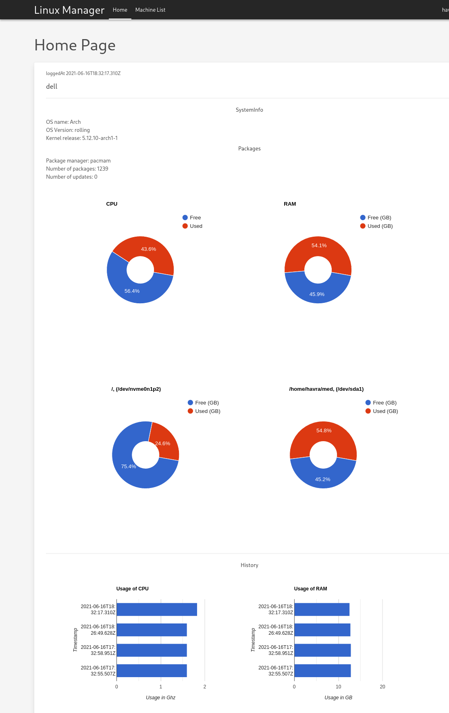

# Linux Manger

React app made for rather dumb school project.
If I manage to finish this (Which is a thing I really don't want to do) it should take form of a system capable of monitoring multiple linux machines.
Currently data about disk, cpu, ram.
Cpu and ram also display their history.

Program is made up of three different parts -- server, client and collector.
Collector is simple utility that gathers data from machine and sends them to server signed with pgpkeys.
Client and sever is self-explanatory.

